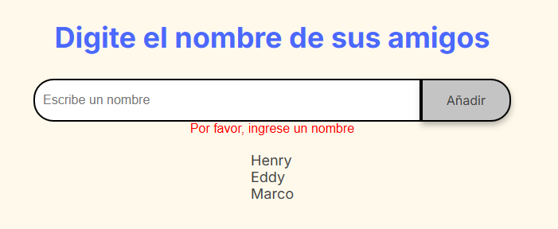
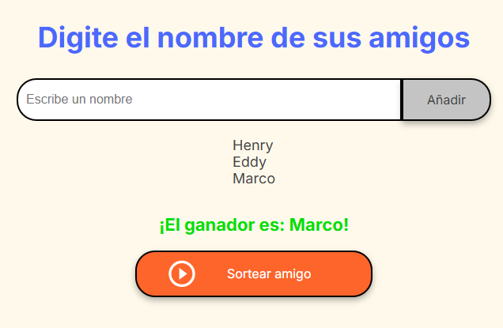

# Proyecto Amigo Secreto

## Descripción
Este proyecto es una aplicación web para organizar un sorteo de "Amigo Secreto". Permite a los usuarios ingresar nombres de participantes y, mediante un sorteo aleatorio, seleccionar un ganador. Es ideal para juegos de fiestas, dinámicas de grupo, sorteos o actividades familiares.

## Estructura del Proyecto

```
Proyecto-amigo-secreto/
├── app.js           # Lógica principal en JavaScript
├── index.html       # Estructura HTML de la aplicación
├── style.css        # Estilos visuales
└── assets/          # Imágenes utilizadas en la interfaz
```

## Uso del Código

1. **Agregar nombres:**
   - Escribe el nombre de un participante en el campo de texto y haz clic en "Añadir" o presiona Enter.
   - El nombre se agregará a la lista de participantes.
   - Si el campo está vacío, se mostrará un mensaje de error.
 

2. **Sortear amigo:**
   - Haz clic en el botón "Sortear amigo" para seleccionar aleatoriamente un ganador entre los nombres ingresados.
   - Si no hay nombres, se mostrará una alerta indicando que no hay participantes.

3. **Iniciar un juego nuevo:**
    - Para reiniciar el juego y iniciar con nuevos nombres recargar la pagina o presiona F5

## Cómo ejecutar el proyecto

1. Descarga o clona este repositorio en tu computadora.
2. Abre la carpeta `Proyecto-amigo-secreto` en tu editor de código o navegador de archivos.
3. Haz doble clic en `index.html` o ábrelo con tu navegador preferido.
4. Puedes comenzar a usar la aplicación.

## Posibles problemas y soluciones

- **No se muestra la lista de nombres:**
  - Asegúrate de que JavaScript esté habilitado en tu navegador.
  - Verifica que los archivos `app.js` y `index.html` estén en la misma carpeta.

- **No se muestran imágenes:**
  - Revisa que la carpeta `assets` y las imágenes existan y estén correctamente referenciadas en el HTML.

- **No se selecciona un ganador:**
  - Asegúrate de haber agregado al menos un nombre antes de sortear.

---
Desarrollado como desafío de lógica y programación.
